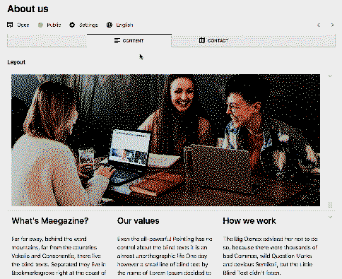

# Kirby TranslatedLayout field plugin
A layout and blocks field with translation logics for Kirby 3.  
Both fields parse the structure from the default lang then replace translations within manually.  
Structure editing is disabled in secondary languages.

### Beta
This is an experimental draft for trying to bring some translation logic to blocks, columns and layouts.  
It turns out to be quite powerful already with just a minimal set of changes compared to the native field behaviour.
**Current state** : Before moving on to more configuration options, I'd like to ensure the base code is robust. If you encounter any bug, please fill an issue.


### Implementation
 - The **primary language** inherits the default LayoutField behaviour and remains *(almost?)* identical to the native Kirby Layout field.
 - The **seconday language** translations of this field are always syncronized (on parse aka `$field->fill($value)`) with layouts and blocks from the default language using their unique `id`.
    - **Fallback** : If a block has no translation, it's replaced with the default language.
    - **Sanitation** : If a block translation is not available in the default language, it's removed. All blocks from the default language are guaranteed to be available for translation in the panel.
    - **Panel GUI** : Non-translateable fields and blocks are disabled, preventing panel users from changing the layout and adding blocks in translations.
    - **Parse** : The syncronized translation is saved as a blocks collection and works fine with the native `$field->toLayout()` & `$field->toBlocks()`.




## Installation

### Requirements
- Kirby 3.8 or above.
- **Warning!** If you already have a layout with translated content, switching to this field will erase all translations unless you manually give the same `id` to blocks/rows/columns in the translations.  
  Please also note that during the beta phase, **there remains a risk of data loss**. Do not use without backups.
- **Note**: If you'd like to manually edit a `translatedlayout` field via the content file, it's not recommended to use this plugin, as it's probably not recommended to use blocks without the panel.  

### Download
Download and copy this repository to `/site/plugins/translatedlayout`.

### Git submodule
```
git submodule add https://github.com/daandelange/kirby3-translatedlayout.git site/plugins/translatedlayout
```

<!-- Unavailable !!
### Composer

```
composer require daandelange/translatedlayout
```
-->

## Setup

### Blueprints
In your page blueprints, you can simply replace a `type: layout` field by `type: translatedlayout`.

Example setup :
````yml
sections:
  content:
    type: fields
    fields:
      mylayout:
        label: Translated Layout Demo
        type: translatedlayout
        translate: true # <--- enables syncing of translations (layout field)
        layouts:
          - "1/1"
          - "1/2, 1/2"
          - "1/3, 1/3, 1/3"
        fieldsets:
          translateable:
            label: Fully Translateable Blocks
            type: group
            fieldsets:
              heading:
                extends: blocks/heading
                translate: true # same as default value
              - list
              - text
          partiallytranslateable:
            label: Blocks with some translateable fields
            type: group
            fieldsets:
              image: # over-rule the translated option of existing fields
                label: Image (non translateable src)
                type: image
                translate: false
                fields:
                  link:
                    translate: false
              url: # custom block example
                name: Url (non-translateable source)
                icon: cog
                fields:
                  link:
                    type: url
                    translate: false
                    required: true
                  text:
                    type: text
                    translate: true
                  
          nontranslateable:
            label: Non-translated blocks
            type: group
            fieldsets:
              line:
                extends: blocks/line
                translate: false # Completely disable whole block translations
        settings: # You can also translate layout settings
          fields:
            class:
              type: text
              width: 1/2
              translate: false  # Don't translate
            purpose:
              type: text
              translate: true  # Translate
      myblock:
        layout:
          label: Translated Blocks Demo
          type: translatedblocks
          fieldsets:
              heading:
                extends: blocks/heading
                translate: true # same as default value
              - text
              line:
                extends: blocks/line
                translate: false # Completely disable whole block translations
````

To use predefined translation settings for the default kirby blocks, you may use :  

````yml
fields:
  content:
    type: translatedlayout
    extends: fields/translatedlayoutwithfieldsets
````
This can be useful for quickly setting up this plugin in a test environment.  
*Beware that this will add the fields to your fieldsets if they don't exist yet.*  

To setup your own fieldsets, prefer copy/pasting from [translatedlayoutwithfieldsets.yml](https://github.com/Daandelange/kirby3-TranslatedLayout/blob/master/src/blueprints/fields/translatedlayoutwithfieldsets.yml) and adapt it to your needs.

### Templates
As for the native `LayoutField` and `BlocksField`, use : `$field->toLayout()`, `$field->toBlocks()`, etc.

## Options
There are no options available yet. Would you like to contribute some ?

## Development
- `npm install` : Install the required dependencies.
- `npm run dev` : Develop mode (listen/compile).
- `npm run build` : Compile for publishing.

## License

MIT - Free to use, free to improve !

However, for usage in commercial projects, please seriously consider to improve the plugin a little and contribute back the changes with a PR, or hire someone to do so.  
For contribution suggestions, you can search for `todo` in the source code or refer to open issues.

## Credits

- [Daan de Lange](https://daandelange.com/)
